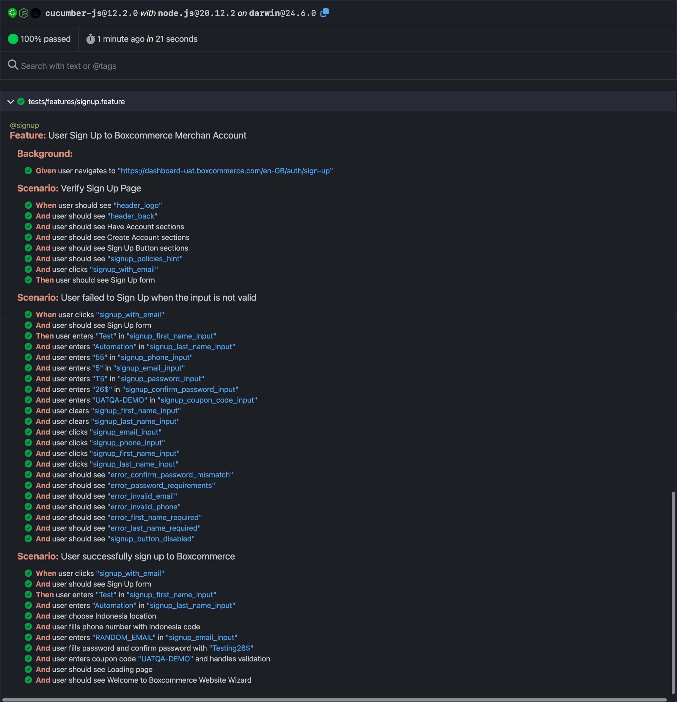

# boxcommerce-ui

This repository contains automated tests for the Boxcommerce UI using Playwright and Cucumber.

## Framework
### **Playwright**
- **Headless modes**: Flexibility to run tests in headless mode for CI/CD
- **Built-in browser binaries**: Playwright have its own browser binaries, so it didn't have dependency on system-installed browsers and ensuring consistent test execution across different environments
- **Parallel execution**: Native support for running tests in parallel for faster execution

### **Cucumber**
- **Readable**: Gherkin syntax allows non-technical person to understand the test scenarios
- **Reusability**: Step definitions can be reused across multiple test scenarios, reducing code duplication
- **Behavior-driven development (BDD)**: Promotes collaboration between developers, testers, and business analysts
- **Living documentation**: the Features files can also be used as documentation of system behavior

### **JavaScript**
- **Easy setup**: Node.js and npm provide straightforward installation and dependency management
- **Familiar syntax**: Widely known language that reduces the learning curve for team members
- **Async/await support**: Native handling of asynchronous operations common in web testing

This combination ensures that anyone cloning this repository can quickly set up and run the automation tests without complex environment configuration, while maintaining code quality and readability for both technical and non-technical team members.

## Prerequisites

- Node.js (v20 or later)
- npm (Node Package Manager)
- Git

## Installation
1. Clone the repository:
   ```
   git clone https://github.com/caresomebody/boxcommerce-ui
   cd boxcommerce-ui
   ```
2. Install dependencies:
   ```
   npm install
   ```
3. Install Playwright browsers:
   ```
   npx playwright install
   ```

## Running Tests

### Local Development
```
# Run all tests
npm test

# Run specific tags
npm test -- --tags @smoke
```

### Using Runner Script

The `runner.sh` script allows you to easily configure and run tests without typing long commands.  
You can adjust the variables inside `runner.sh` to control how the tests run.

```
# Run tests with default settings
sh runner.sh

# Run with specific tag
# 1. Open runner.sh
# 2. Set TAGS (e.g., TAGS=@smoke)
sh runner.sh

# Run in non-headless mode
# 1. Open runner.sh
# 2. Set HEADLESS=false
sh runner.sh

# Run using a different browser
# 1. Open runner.sh
# 2. Set BROWSER (e.g., BROWSER=firefox)
sh runner.sh
```

## Project Structure
```
boxcommerce-ui/
├── node_modules/                # Dependencies (auto-generated)
├── reports/                     # Test execution reports
├── screenshots/                 # Test screenshots/evidence
├── src/                         # Source code
│   ├── locators/                # Page element locators
│   ├── support/                 # Test support utilities
│   └── utils/                   # Helper utilities
├── tests/                       # Test specifications
│   ├── features/                # Gherkin feature files
│   └── step_definitions/        # Step implementation
├── .gitignore                   # Git ignore rules
├── cucumber.js                  # Cucumber configuration
├── package-lock.json            # Dependency lock file
├── package.json                 # Project configuration
├── playwright.config.js         # Playwright configuration
├── README.md                    # Project documentation
└── runner.sh                    # Test execution script
```
## Open Reports
  ```
  open reports/cucumber-report.html
  ```

## Report Example


## Recording How to Run the Automation
[Watch Setup and Execution Demo]( https://youtu.be/d2qmUaA3i2w "Step by step Install and Running the Automation")
